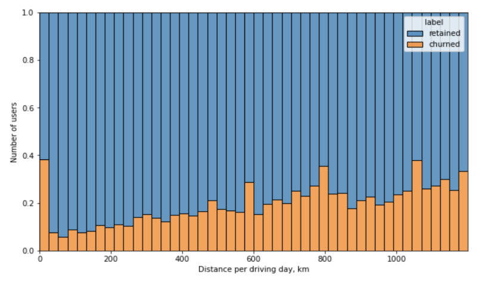
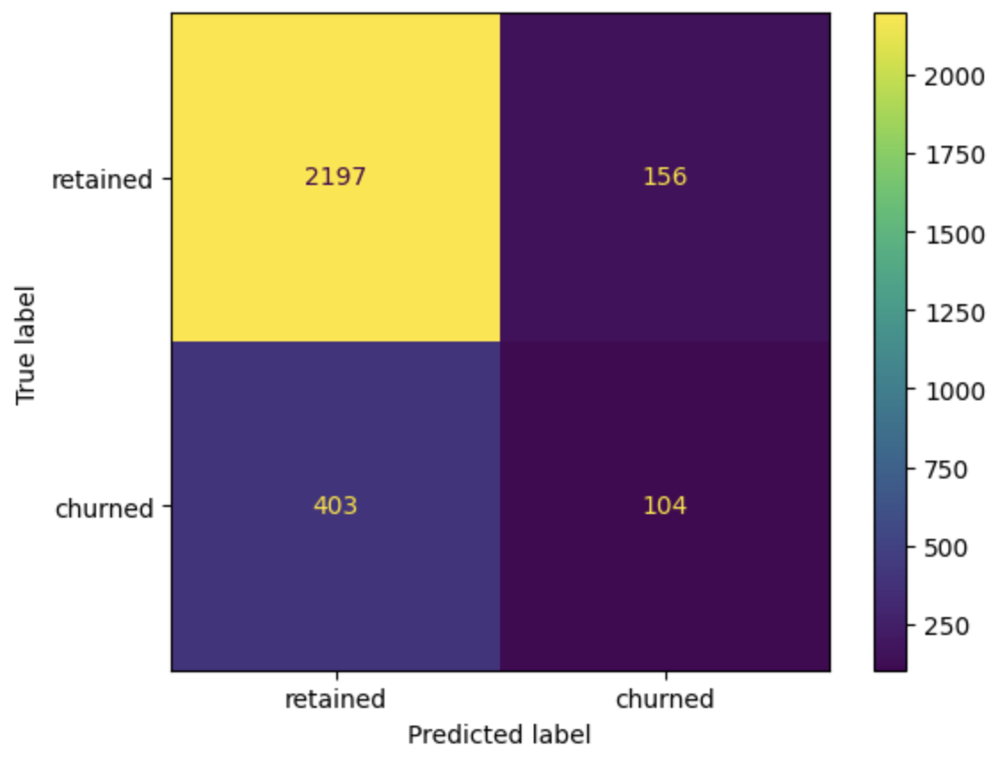

# user_churn_project
## Overview
This project was completed within Google Advanced Data Analytics Specialization. The goal was to build a machine learning model to predict user churn on the Waze app. Churn is defined as the number of users who have uninstalled the Waze app or stopped using the app. The analysis focused on monthly user churn.  
## Data Understanding
The dataset contains 12 variables of object, float, and integer data types. It was observed that 18% of the users had churned, while 82% were retained. Approximately 4.7% of the data in the ‘label’ variable was missing. 64% of users were iPhone users, and 36% were Android users. The median kilometers per driving day for churned users was significantly higher than that of retained users.  

*The churn rate tends to increase as the mean daily distance driven increases.*
## Model and Evaluation
A binomial logistic regression model was built to predict user churn. The variable ‘activity_days’ was found to negatively influence churn prediction, which means the more activity days a user has, the less likely they are to churn. The model had a precision of 56% and a low recall of 8%. 

Tree-based models (random forest and XGBoost) were also built. The XGBoost model showed a better recall score of 19.1% on validation data and 20.5% on testing data compared to the random forest model's 12.8% on validation data. Key features identified by the XGBoost model include ‘km_per_hour’, ‘number_days_after_onboarding’, ‘percent_sessions_in_last_month’, ‘duration_minutes_drives’, and ‘total_sessions_per_day’.  

*Confusion matrix for XGBoost model on testing data*
## Conclusion
The analysis revealed that users driving long distances and those using the app less frequently are more likely to churn. There was no statistically significant difference in the average number of drives between iPhone and Android users. The regression and tree-based models had limitations in accurately predicting user churn, primarily due to low recall. It was also noted that there are likely to be errors in the initial data, such as unusually high driving distances per day and session counts. The report suggests checking the initial data for errors and gathering additional data, such as error report information and user satisfaction rates, for future analysis. 
